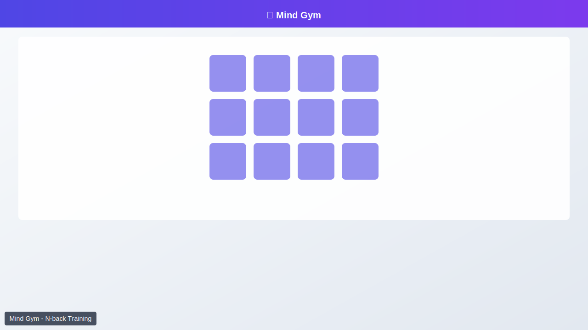

<h1 align="center">🧠 Mind Gym</h1>

<p align="center">
  <strong>Browser-based cognitive training with adaptive difficulty, N-back training, and spaced repetition</strong>
</p>

<p align="center">
  <a href="https://github.com/LessUp/mind-gym/actions/workflows/ci.yml"></a>
  <a href="https://github.com/LessUp/mind-gym/actions/workflows/pages.yml"></a>
  <a href="LICENSE"></a>
  <a href="#"></a>
</p>

<p align="center">
  <b>English</b> • <a href="README.zh-CN.md">简体中文</a>
</p>

<p align="center">
  Zero dependencies • Works offline • Bilingual (EN/ZH)
</p>

---

<p align="center">
  <a href="https://lessup.github.io/mind-gym/">🎮 Play Now</a>
</p>

## 🎬 Preview

<p align="center">
  
  
</p>

<p align="center">
  <kbd>N</kbd> New Game · <kbd>P</kbd> Pause · <kbd>H</kbd> Hint · <kbd>↑↓←→</kbd> Navigate · <kbd>Enter</kbd> Flip
</p>

---

## ✨ Features

5 science-backed training modes to improve cognitive function:

| Mode                | Focus            | Description                           |
| ------------------- | ---------------- | ------------------------------------- |
| **Classic**         | Visual memory    | Match pairs in 4×4 / 4×5 / 6×6 grids  |
| **Countdown**       | Speed            | Race against time limits              |
| **Daily Challenge** | Consistency      | Same layout for all players worldwide |
| **N-back**          | Working memory   | Match stimulus N steps back           |
| **Delayed Recall**  | Long-term memory | Post-game recognition test            |

**Adaptive Intelligence**: ELO-like rating (600-1600) auto-adjusts difficulty based on your performance.

**Fully Featured**: 🌍 i18n (auto-detected) • 📲 PWA installable • ⌨️ Keyboard navigation • 💾 Export/JSON backup • 🏆 Achievements

---

## 🚀 Install as PWA

**Desktop (Chrome/Edge)**: Visit site → Click ➕ install icon → Launch from desktop

**iOS Safari**: Share → "Add to Home Screen"

**Android Chrome**: Menu → "Add to Home screen"

---

## 🛠 Development

```bash
git clone https://github.com/LessUp/mind-gym.git
cd mind-gym && npm install
npm test           # Run unit tests
npm run build:css  # Compile Tailwind
```

**Stack**: Vanilla JS (ES2022) • Tailwind CSS 3.4 • Jest 30 • GitHub Pages

- ⚡ <100KB total (no runtime dependencies)
- 🎯 Lighthouse 95+

<details>
<summary>Project Structure</summary>

```
├── index.html    # SPA entry
├── app.js        # Game orchestrator
├── sw.js         # Service Worker
├── src/          # Core modules
│   ├── storage.js, stats.js, modes.js, i18n.js, fsrs.js
├── __tests__/    # Jest tests
├── docs/         # User guides
└── openspec/     # Spec-driven development
    └── specs/    # Capability specifications
```

</details>

---

## 📖 Documentation

- [Documentation](docs/) — User guides and tutorials

---

## 🤝 Contributing

See [CONTRIBUTING.md](CONTRIBUTING.md). Steps: Fork → Review specs → Code → Test (`npm test`) → PR

---

## 📜 License

[MIT License](LICENSE) © LessUp

---

<p align="center">Made with ❤️ for cognitive health</p>
