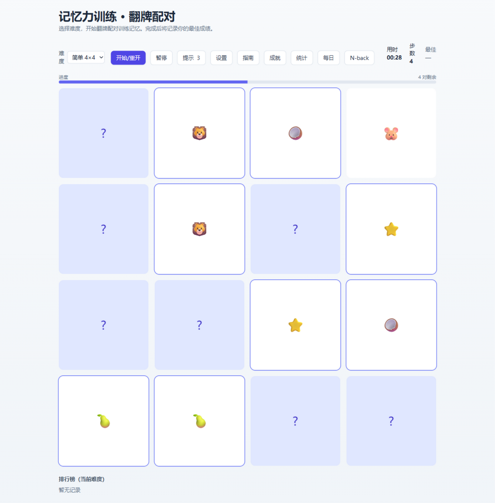
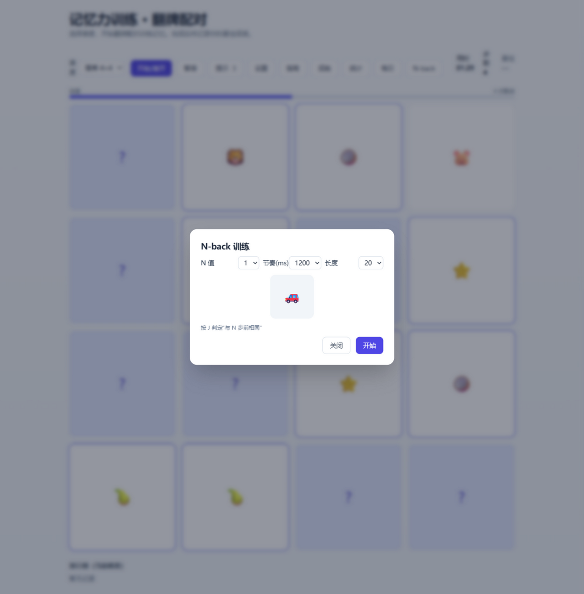
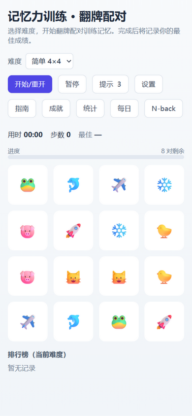
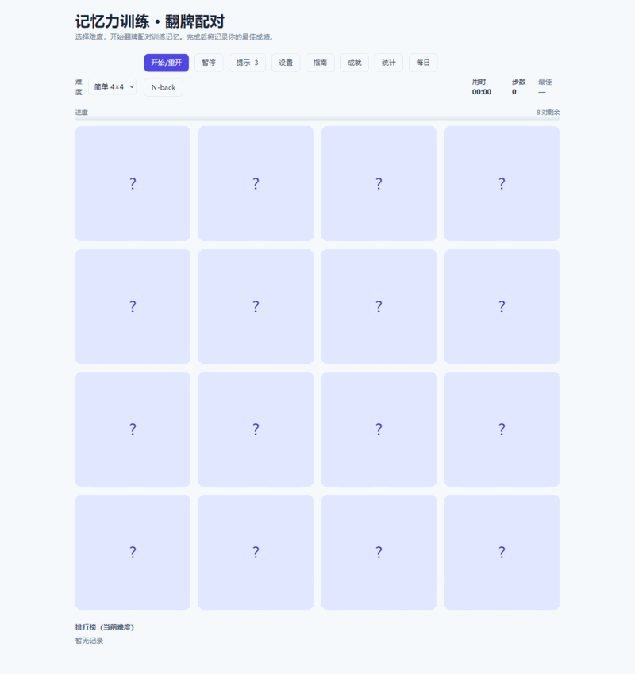

# Mind Gym

A pure front-end, zero-dependency browser-based cognitive training PWA. Supports classic pairs, N-back, daily challenges, and memory quizzes — ready to play out of the box, works offline, and all data is stored locally.

[Live Demo](https://build-workbench.github.io/mind-gym/) · [GitHub Repository](https://github.com/build-workbench/mind-gym) · [Report an Issue](https://github.com/build-workbench/mind-gym/issues)

---

## Interface Preview



|                     N-back training                      |                    Mobile (start preview)                     |
| :------------------------------------------------------: | :-----------------------------------------------------------: |
|  |  |

**Demo** (start preview → card matching → memory quiz after clearing):



---

## Training Modes

| Mode            | How to Play                                                                      | Training Dimension |
| :-------------- | :------------------------------------------------------------------------------- | :----------------- |
| **Classic Pairs** | Flip cards to find matching items (`4×4` / `4×5` / `6×6`), with a timed mode and ELO-like adaptive difficulty adjustment | Visual memory, attention |
| **N-back Training** | Watch symbols appear in sequence and press the judgment key when the current item matches the one N steps back; multiple difficulty levels available | Working memory, focus |
| **Daily Challenge** | A fixed random question set generated daily, identical across the whole network; check in daily to record your practice streak | Consistency, competitiveness |
| **Recall Quiz** | After completing a pairs round, take a quick recognition test on that round's cards, consolidating weak items based on the FSRS-4.5 algorithm | Long-term memory consolidation |

> Card themes can be switched freely in settings: `Emoji`, `numbers`, `letters`, `geometric shapes`, and `solid color blocks`.

---

## Controls & Keyboard Shortcuts

Supports touch, mouse clicks, and full keyboard operation:

| Key               | Function                           |
| :---------------- | :--------------------------------- |
| `↑` `↓` `←` `→`   | Move the cursor to select cards    |
| `Enter` / `Space` | Flip the currently selected card   |
| `N`               | Restart / start a new round        |
| `P`               | Pause / resume                     |
| `H`               | Use a hint (consumes a hint count) |
| `J`               | In N-back mode, judge "same as N steps back" |
| `Esc`             | Close dialogs or panels            |

---

## Installation & Offline Use

This project is a standard offline-first PWA — no download or installation required, no network connection needed:

- **Desktop (Chrome / Edge)**: after visiting the page, click the "Install" icon to the right of the address bar to run it as a standalone desktop app.
- **Mobile (iOS / Android)**: in Safari, tap "Share" at the bottom → "Add to Home Screen"; in Chrome, tap the menu "Install app".
- **Data privacy**: all training history, mastery, and achievements are stored locally in the browser (`localStorage`) and can be exported or imported as a JSON backup with one click in settings.

---

## Running Locally

Implemented in plain native JavaScript with no build dependencies:

```bash
git clone https://github.com/build-workbench/mind-gym.git
cd mind-gym

# 方式 1：npm 启动
npm install
npm run dev          # 访问 http://localhost:3000

# 方式 2：任意静态服务器直接运行
npx serve .
# 或 python3 -m http.server 3000
```

---

## License

Open-sourced under the [MIT License](LICENSE).

---

<a id="chinese"></a>
# Mind Gym

纯前端、零依赖的浏览器端认知训练 PWA。支持经典配对、N-back、每日挑战与记忆测验，开箱即玩、离线可用、数据全本地存储。

[在线试玩 Live Demo](https://build-workbench.github.io/mind-gym/) · [GitHub 仓库](https://github.com/build-workbench/mind-gym) · [报告问题](https://github.com/build-workbench/mind-gym/issues)

---

## 界面预览


|                N-back 训练                |              移动端（开局预览）               |
| :---------------------------------------: | :-------------------------------------------: |
|  |  |

**运行效果**（开局预览 → 翻牌配对 → 通关后的回忆测验）：


---

## 训练模式

| 模式            | 玩法说明                                                                         | 训练维度         |
| :-------------- | :------------------------------------------------------------------------------- | :--------------- |
| **经典配对**    | 翻开卡牌寻找相同项（`4×4` / `4×5` / `6×6`），支持限时模式与类 ELO 自适应难度调节 | 视觉记忆、注意力 |
| **N-back 训练** | 观察连续出现的符号，当当前项与前第 N 步相同时按下判定键，难度多档可调            | 工作记忆、专注力 |
| **每日挑战**    | 每日生成全网统一的固定随机题组，每日打卡记录连续练习成绩                         | 一致性、竞技性   |
| **回忆测验**    | 配对通关后对本局卡面进行快速再认测试，基于 FSRS-4.5 算法巩固薄弱项               | 长时记忆巩固     |

> 卡面主题可在设置中自由切换：`Emoji`、`数字`、`字母`、`几何形状` 与 `纯色块`。

---

## 操作指南与快捷键

支持触控、鼠标点击及全键盘操作：

| 按键              | 功能                               |
| :---------------- | :--------------------------------- |
| `↑` `↓` `←` `→`   | 移动光标选择卡牌                   |
| `Enter` / `Space` | 翻开当前选中的卡牌                 |
| `N`               | 重新开始 / 新开一局                |
| `P`               | 暂停 / 继续                        |
| `H`               | 使用提示（消耗提示次数）           |
| `J`               | N-back 模式下判定「与 N 步前相同」 |
| `Esc`             | 关闭弹窗或面板                     |

---

## 安装与离线使用

本项目为标准离线优先 PWA，无需下载安装包，不依赖网络连接：

- **桌面端（Chrome / Edge）**：访问网页后，点击地址栏右侧的「安装」图标，即可作为独立桌面应用运行。
- **移动端（iOS / Android）**：Safari 点击底部「分享」→「添加到主屏幕」；Chrome 点击菜单「安装应用」。
- **数据隐私**：所有训练历史、掌握度与成就均存储于浏览器本地（`localStorage`），可在设置中一键导出或导入 JSON 备份。

---

## 本地运行

纯原生 JavaScript 实现，无构建依赖：

```bash
git clone https://github.com/build-workbench/mind-gym.git
cd mind-gym

# 方式 1：npm 启动
npm install
npm run dev          # 访问 http://localhost:3000

# 方式 2：任意静态服务器直接运行
npx serve .
# 或 python3 -m http.server 3000
```

---

## 许可证

基于 [MIT License](LICENSE) 开源。
