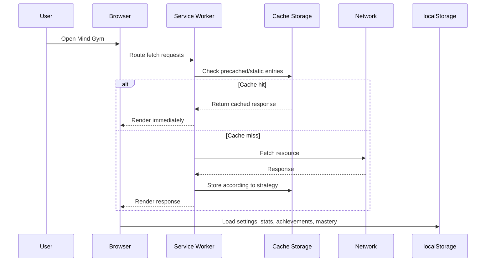
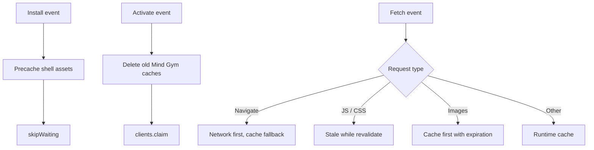

# PWA and Offline Strategy

Offline support is not decorative in Mind Gym. It is part of the product promise: the app should remain useful during short sessions, on unstable mobile connections, and after the first successful load.

  
Core distinction

  

    
The offline story has two separate parts: Service Worker protects the shipped application shell, while localStorage protects player-owned progress. Keeping those roles separate is what makes the system honest and inspectable.

  

## Delivery model

Mind Gym combines three browser capabilities:

1. **Service Worker (`sw.js`):** caching and update flow.
2. **Web App Manifest (`manifest.webmanifest`):** installability and standalone launch.
3. **localStorage (`src/storage.js`):** durable user-owned progress.

Together they create a product that behaves more like a resilient local tool than a page that merely happens to contain a game.

## Request and cache flow

This path explains why offline behavior is not one feature. Cache Storage protects code and shell assets, while localStorage restores player history and product settings.

## Strategy matrix

| Resource class        | Representative examples                | Strategy in practice                    | Why                                                       |
| --------------------- | -------------------------------------- | --------------------------------------- | --------------------------------------------------------- |
| **Navigation / HTML** | `./`, `index.html`                     | Network-first with cache fallback       | Prefer fresh shell when online, but still recover offline |
| **Core JS/CSS**       | `app.js`, `src/*.js`, `assets/app.css` | Stale-while-revalidate / static caching | Fast repeat loads with background freshness               |
| **Images and icons**  | `assets/icon.svg`, PNG icons           | Cache-first with expiration             | Stable assets benefit from aggressive reuse               |
| **Fonts**             | Google Fonts requests                  | Dedicated cache handling                | External dependencies need separate treatment             |
| **Progress data**     | settings, stats, achievements, mastery | localStorage persistence                | This is user data, not HTTP cache content                 |

## What is precached

The Service Worker explicitly precaches the application shell and major runtime modules, including:

- `index.html`
- `app.js`
- key `src/` modules in load order
- `manifest.webmanifest`
- core icons and compiled CSS
- support pages such as `404.html` and `offline.html`

This is important because the offline story is not magical. It is a concrete asset inventory maintained in `sw.js`.

## Installability model

| Capability                  | User-facing outcome                                    |
| --------------------------- | ------------------------------------------------------ |
| **Manifest metadata**       | Browser can present the app as installable             |
| **Standalone display mode** | App can launch without regular browser chrome          |
| **Icons and theme colors**  | Installed surface looks deliberate rather than generic |
| **Start URL / scope**       | Installed launches resolve back into the app shell     |

## Persistence model

HTTP caching alone would not be enough. Mind Gym also preserves user-owned state in localStorage.

| Data family         | Storage role                                                |
| ------------------- | ----------------------------------------------------------- |
| Settings            | Theme, sound, countdown presets, language, mode preferences |
| Performance data    | Best scores, leaderboards, aggregate stats                  |
| Progression data    | Achievements, adaptive rating, spaced / mastery data        |
| Daily participation | Completion markers keyed by date and difficulty             |

This split matters: the Service Worker protects the **code and shell**, while localStorage protects the **player's local history**.

## Update behavior

The update posture is conservative by design: fetch fresh shell content when possible, but keep cached fallbacks so short sessions do not fail just because the network path is weak.

## Product strengths created by the PWA model

- **Short-session reliability:** the app can open quickly on repeat visits.
- **Lower perceived fragility:** a weak connection does not instantly collapse the experience.
- **Privacy by default:** everyday play does not depend on server-side accounts.
- **Static deployment leverage:** GitHub Pages remains a viable host even with app-like behavior.

## Limitations and honest boundaries

Mind Gym's offline story is strong but not unlimited:

- The **first visit still needs a network connection** to populate caches.
- External resources such as fonts remain subject to browser caching behavior and network policy.
- Offline behavior depends on **Service Worker support and browser storage availability**.
- Local-first progress means there is **no built-in cross-device sync**.

## Verification checklist for contributors

When you change assets, runtime modules, or the app shell, review:

1. whether `sw.js` precache entries need updating,
2. whether install metadata still describes the shipped experience,
3. whether new persisted data belongs in localStorage and follows the `memory_match_` key convention,
4. whether the docs still describe the offline model accurately.

## Bottom line

Mind Gym's PWA architecture is not there to imitate a native app. It exists to make a browser-delivered training system dependable, inspectable, and useful after the first load.
