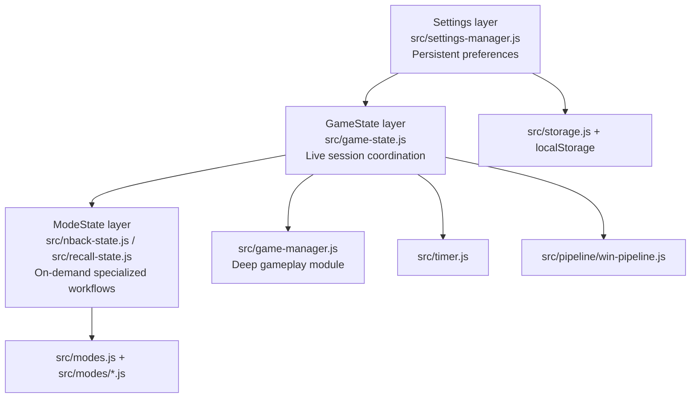

# State Architecture

Mind Gym’s central architectural move is to separate state by **time horizon** and **responsibility** rather than by UI component. The result is a three-layer model:

- **Settings** — durable preferences that should survive sessions.
- **GameState** — the live session coordinator for the currently running game.
- **ModeState** — specialized state machines for modes such as N-back and delayed recall.

## The three-layer model

## Why this split works

### Settings own policy that should persist

Settings include theme, accent, motion, volume, language, countdown values, selected card face, and toggle-style product preferences such as adaptive difficulty and spaced repetition. These values belong in a persistent manager because they describe **how the user wants the system to behave**, not what a current round is doing.

### GameState owns the live match

`src/game-state.js` manages the current run: difficulty, total pairs, timers, pause state, hints, combo tracking, daily flags, seen-card tracking, and the relationship to `GameManager`. This is the layer that keeps gameplay coherent from first action to completion.

### ModeState owns mode-specific algorithms

N-back and delayed recall have different temporal structures from classic matching. Instead of stuffing every mode variable into one universal state object, Mind Gym isolates them in `src/nback-state.js` and `src/recall-state.js`. This keeps mode logic testable and avoids polluting unrelated gameplay paths.

## Ownership matrix

| State concern | Owning module | Why it belongs there |
| --- | --- | --- |
| Theme, sound, language, countdown presets | `src/settings-manager.js` | These are persistent user preferences, not round data. |
| Elapsed time, lock state, hints, combo, daily flags | `src/game-state.js` | These are runtime session concerns shared across the main gameplay loop. |
| First-card / second-card / match resolution | `src/game-manager.js` | Matching is complex enough to deserve a focused deep module. |
| N-back sequence, targets, hits, response time | `src/nback-state.js` | The mode is sequential and timed in a way classic mode is not. |
| Recall candidate generation and scoring | `src/recall-state.js` | Delayed recall has its own construction and scoring rules. |
| Durable persistence primitives | `src/storage.js` | Storage should normalize and load/save data, not coordinate gameplay. |

## Deep modules as state discipline

The three-layer model is reinforced by deep modules. They matter because state architectures often fail not at the top-level diagram, but inside overloaded helper code.

### `src/game-manager.js`

This module encapsulates flip validation, second-card handling, move counting, match detection, win checks, and board lock behavior. Consumers call a small interface; they do not manipulate card-pair internals directly.

### `src/modal-manager.js`

Modal state is deceptively tricky: stack order, focus trapping, focus restoration, and close behavior can all become scattered bugs. The modal manager keeps that complexity local.

### `src/pipeline/win-pipeline.js`

Post-win state transitions are not just UI polish. They affect timers, stats, leaderboards, mastery, achievements, and recall prompts. The win pipeline keeps the sequence explicit without forcing `app.js` to inline every step.

## Typical runtime sequence

1. Settings are loaded or updated.
2. A game initializes GameState with difficulty, pair count, and mode context.
3. `GameState.flip()` delegates pair logic to `GameManager.flip()`.
4. Mode-specific helpers run only when a selected mode needs them.
5. On completion, the win pipeline coordinates durable side effects.
6. Persistent stores are updated only at clearly defined boundaries.

## State invariants worth preserving

- **Settings must remain valid even if storage data is malformed.**
- **GameState should be resettable without leaking prior round internals.**
- **Mode-specific state should be disposable when leaving a mode.**
- **Deep modules should expose small interfaces and own their internal transitions.**
- **Persistence and orchestration should not be coupled more tightly than necessary.**

## Why not a single global state object?

A single giant state object would make simple reads easy at first and long-term change harder later. It would blur the difference between:

- preference and event,
- storage and runtime,
- generic gameplay and specialized modes,
- state ownership and state observation.

Mind Gym chooses explicit boundaries instead. The benefit is not theoretical purity; it is localized reasoning.

## Contributor guidance

When changing code, use the state model as a placement test:

- If a value should survive reloads, start by checking **Settings** or **storage**.
- If it describes the active round, start with **GameState**.
- If it exists only for one training mode, start with **ModeState**.
- If the logic is compact at the call site but intricate inside, ask whether it belongs in a **deep module**.
