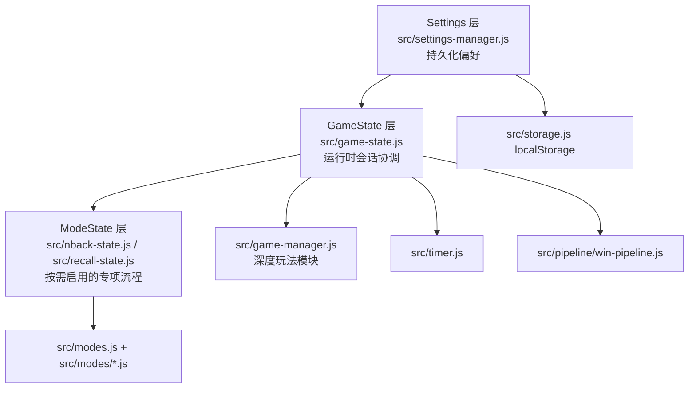

# 状态架构

Mind Gym 最核心的架构动作，是按 **时间尺度** 和 **责任归属** 来切分状态，而不是按 UI 组件切分。最终形成了三层模型：

- **Settings：** 应该跨会话保留的持久偏好。
- **GameState：** 当前局面运行时的核心协调层。
- **ModeState：** N-back、延迟回忆等专项模式自己的状态机。

  
放置规则

  

    
如果一个值应当跨刷新保留，先看 Settings；如果它只服务当前对局，先看 GameState；如果它只属于某一种训练模式，多半应该进入 ModeState。

  

## 三层模型

这张图最关键的是纵向分层：持久化策略先进入实时会话控制，只有在某个模式需要专项行为时，才会继续落到 ModeState。

## 为什么这样拆分有效

### Settings 负责应该持久化的策略

主题、强调色、动效、音量、语言、倒计时配置、卡面主题，以及自适应难度、间隔重复等偏好，都属于“用户希望系统如何工作”的描述，而不是“当前一局正在发生什么”。因此它们应由独立的持久化设置管理器负责。

### GameState 负责当前对局

`src/game-state.js` 管理当前会话：难度、总配对数、计时器、暂停状态、提示次数、连击、每日挑战标记、已见卡片追踪，以及与 `GameManager` 的关系。这一层负责保证从第一步操作到结算的主流程始终一致。

### ModeState 负责模式专属算法

N-back 与延迟回忆的时间结构与经典配对明显不同。如果把所有模式变量都塞进一个通用状态对象，主路径会被专项逻辑污染。Mind Gym 通过 `src/nback-state.js` 和 `src/recall-state.js` 将它们隔离出来，使专项逻辑更可测，也更易替换。

## 状态归属矩阵

| 状态类型                                     | 归属模块                  | 为什么归它                                 |
| -------------------------------------------- | ------------------------- | ------------------------------------------ |
| 主题、音效、语言、倒计时预设                 | `src/settings-manager.js` | 这些是持久偏好，而不是对局数据。           |
| 已耗时长、锁盘状态、提示、连击、每日挑战标记 | `src/game-state.js`       | 这些是主循环共享的运行时会话信息。         |
| 第一张牌 / 第二张牌 / 匹配判定               | `src/game-manager.js`     | 配对逻辑足够复杂，应当由深模块单独负责。   |
| N-back 序列、目标数、命中、反应时            | `src/nback-state.js`      | 该模式具有经典模式没有的序列与节奏要求。   |
| 回忆测试的题目构造与评分                     | `src/recall-state.js`     | 延迟回忆有独立的构造和评分规则。           |
| 持久化底层读写                               | `src/storage.js`          | 存储层应负责规范化与读写，而不是协调玩法。 |

## 深模块如何强化状态纪律

三层模型并不是只靠顶层图示成立，它还需要深模块来防止局部复杂度失控。

### `src/game-manager.js`

该模块封装了翻牌合法性判断、第二张牌处理、步数统计、匹配检测、胜利判断和锁盘行为。调用方只需面对小接口，而不需要直接操作配对内部状态。

### `src/modal-manager.js`

模态框状态往往看起来简单，实际上很容易散落出焦点陷阱、堆栈顺序、关闭恢复等问题。ModalManager 把这类复杂度收束在一个地方。

### `src/pipeline/win-pipeline.js`

胜利后的状态变更并不只是 UI 装饰，它还涉及计时器、统计、排行榜、掌握度、成就和回忆测试。WinPipeline 让这一连串动作保持显式顺序，而不必把所有步骤都硬编码进 `app.js`。

## 典型运行时序列

1. 读取或更新 Settings。
2. 根据难度、配对数和模式上下文初始化 GameState。
3. `GameState.flip()` 再委托给 `GameManager.flip()` 处理配对逻辑。
4. 只有在选中某种模式时，专项状态才会参与执行。
5. 对局完成后，由胜利管道协调持久化副作用。
6. 只有在清晰定义的边界上才写入持久化存储。

## 需要守住的状态不变量

- **即使本地存储数据损坏，Settings 仍必须可恢复为有效值。**
- **GameState 应当能完整重置，而不泄漏上一局内部状态。**
- **离开某个模式时，该模式的专属状态应可被丢弃。**
- **深模块应暴露小接口，并独立拥有内部状态迁移。**
- **持久化与运行时编排不应被绑得过紧。**

## 为什么不使用一个全局巨型状态对象？

全局巨型状态对象短期看起来读取方便，长期却会抹平关键差异：

- 偏好与事件的差异，
- 存储与运行时的差异，
- 通用玩法与专项模式的差异，
- 状态拥有者与状态观察者的差异。

Mind Gym 选择显式边界，不是为了理论纯度，而是为了让推理局部化。

## 给贡献者的放置测试

当你准备添加或修改状态时，可以这样判断落点：

- 如果它应当在刷新后仍保留，先检查 **Settings** 或 **storage**。
- 如果它描述的是当前这一局，先检查 **GameState**。
- 如果它只属于某一种训练模式，先检查 **ModeState**。
- 如果调用点很轻、内部逻辑却很重，就要考虑它是否应成为 **深模块**。
