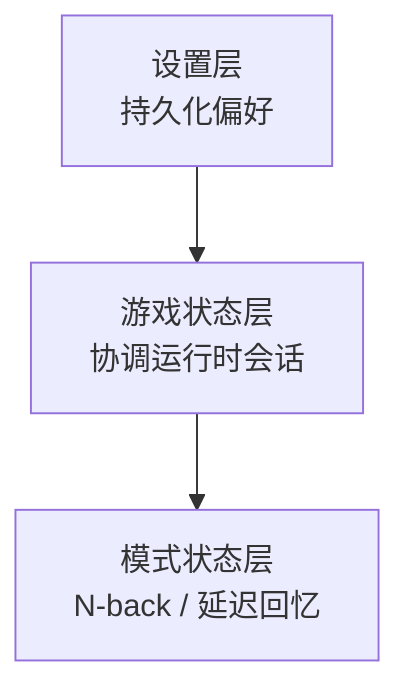

# 状态架构

项目采用三层状态模型：设置层保存持久偏好，游戏状态层协调当前局面，模式状态层承载 N-back、延迟回忆等专项流程。这种划分减少了偶然耦合，也让每一层都拥有更清晰的测试边界。

```mermaid
flowchart TD
  Settings["设置层\n持久化偏好"] --> GameState["游戏状态层\n协调运行时会话"]
  GameState --> ModeState["模式状态层\nN-back / 延迟回忆"]
```

这一设计也呼应了仓库对“深模块”的偏好：对外接口尽量小，内部实现复杂度尽量封装。若需要更细节的内容，可继续阅读仓库中的状态管理设计文档与规范。
